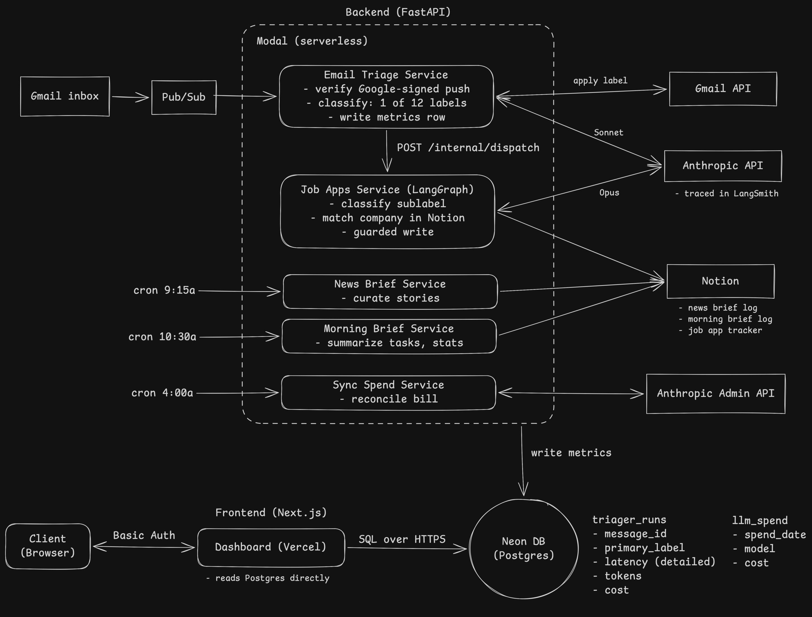

# agents

<p align="center">
  
</p>

Five small agents I run for myself. They label my email, move my job applications through a Notion tracker, write my morning and news briefs, and keep an eye on my own API bill, all serverless for ~ $20/mo. I started on Notion's Custom Agents, but I couldn't see how they performed and the trial would have cost over $500/mo, so I rebuilt them as my own. Flashy overview: [agents.aaronjchau.com](https://agents.aaronjchau.com).

This is the public mirror of my private repo, with personal info and prompts de-identified. The files in `services/*/prompts/` are condensed placeholders that keep the same structure.

- **Triager** - labels every incoming email with one of 12 categories
- **Job Apps** - classifies job app emails, applies the Gmail sublabel, finds the company in my Notion tracker, and advances its status
- **News Brief** - writes a daily Notion brief of curated AI and tech news from my "News"-labeled email
- **Morning Brief** - pulls my tasks, focus hours, news, email, and calendar into one Notion page each morning
- **Spend Sync** - reconciles against the Anthropic Admin Cost API every day, so the dashboard's numbers are accurate

## Stack

| Layer | Tools |
|---|---|
| Backend | Python, FastAPI, Pydantic, LangGraph, SQLAlchemy, Anthropic SDK |
| Deploy | Modal, Alembic migrations |
| Data | Neon Postgres |
| Observability | LangSmith, Modal logs |
| Public site | Next.js, React, Tailwind (`site/`, developed in this repo) |
| Dashboard | (private repo only) Next.js on Vercel |

## Key Items

- `docs/design.md` - design behind each service
- `services/job_apps/graph.py` - LangGraph pipeline to classify, match, and update
- `services/triager/api.py` - Gmail Pub/Sub webhook, OIDC-verified
- `shared/auth.py` - bearer auth

## How to Run

The whole suite of 600+ tests runs with no credentials needed:

```bash
uv sync --frozen
make test
```

To run a service for real, the `Makefile` wraps every target that needs a secret in 1Password's `op run`. The committed `.env.tpl` lists each variable as a placeholder `op://<your-vault>/<your-item>/<FIELD>` reference. Point those at your own 1Password item, or skip `op` and export plain env vars (see `shared/settings.py`).

```bash
make help            # list all targets
make migrate         # alembic upgrade head (op run)
make serve-triager   # run a service locally via modal serve (op run)
```

MIT licensed.
